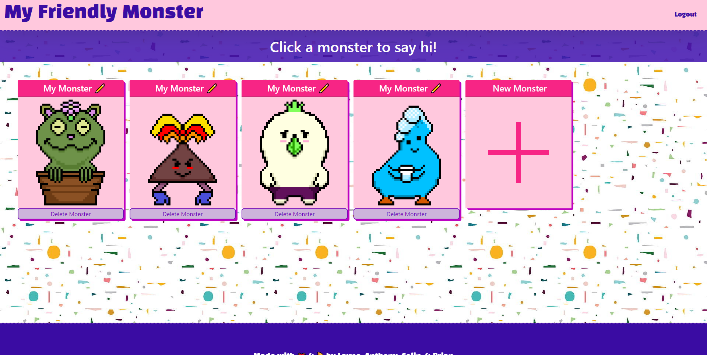

# My friendly monster

## Description

Friendly monsters to make you feel happy XD!

## Table of Contents
 - [installation](#installation)
 - [usage](#usage)
 - [credits](#credits)
 - [license](#license)
 - [how-to-contribute](#how-to-contribute)
 - [questions](#questions)

## Installation
To install necessary dependencies, run the following command:
npm run i

## Usage

Screenshot: 

Live Deployment:
https://radiant-garden-89222.herokuapp.com/

## Credits

Contributors: Anthony Cedrone, Brian Chapman, Colin Deery, Layne Nigro

## License
This project is licensed under the MIT license. https://choosealicense.com/licenses/mit/

## How to Contribute

To contribute to our application, please reach out to us via email at Antcedrone952gmail.com, Chapman.brian86@gmail.com, Colinbdeery@gmail.com, Laynenigro@gmail.com.

## Questions

Githin Profile links: https://github.com/antced, https://github.com/BrianSChapman, https://github.com/ColinDeery, https://github.com/LayneNi

For any additional questions please reach out to us via email at Antcedrone952gmail.com, Chapman.brian86@gmail.com, Colinbdeery@gmail.com, Laynenigro@gmail.com.
